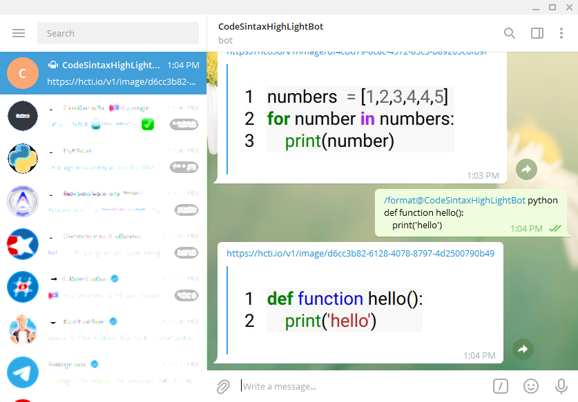

# CodeSintaxHightLigth

**@CodeSintaxHightLight** helps you to format messages with programming language code

## Requirements

You need to have python installed in your system

(https://www.python.org/downloads/) https://www.python.org/downloads/

### Install required libraries

`pip install-r requirements.txt`

## Run

`python codesintaxhighlightbot.py`

## Commands

- **/help** Show bot's help
- **/langs** Show supported langs
- **/format** Format the code

## Format command usage

For usage `/format` command use the below sintax

```python
/format python

def function hello():
	print('hello')
```

## Sreenshot

